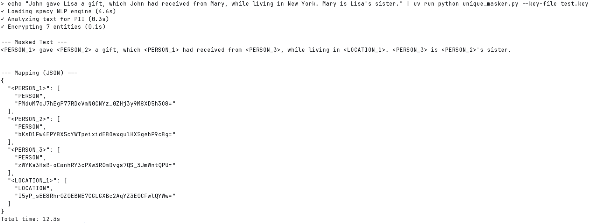
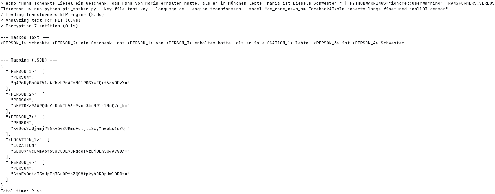

# PII Masker

A privacy-first tool for anonymizing and deanonymizing text using Microsoft Presidio with unique, encrypted placeholders.

## Overview

PII Masker replaces personally identifiable information (PII) in text with unique placeholders like `<PERSON_1>`, `<LOCATION_2>`, while maintaining a secure mapping for later restoration. The mapping uses AES encryption, ensuring that only holders of the encryption key can restore the original text.

### Features

- **Multi-language support**: English, Spanish, French, German, Italian, Portuguese, Chinese, Japanese, Korean
- **Multiple NLP engines**: spaCy, Stanza, Transformers, local multihead (`.pt`)
- **Reversible anonymization**: Encrypted mappings allow secure restoration
- **Consistent placeholders**: Same entity gets the same placeholder throughout the document
- **Custom recognizers**: Add your own pattern recognizers via YAML or CLI

## Installation

```bash
# Clone the repository
git clone https://github.com/yourusername/pii_masker.git
cd pii_masker

# Install dependencies with uv
uv sync
```

### spaCy Models

```bash
# English (large)
uv run spacy download en_core_web_lg

# Additional languages
uv run spacy download de_core_news_lg  # German
uv run spacy download it_core_news_lg  # Italian
uv run spacy download fr_core_news_lg  # French
```

## Usage

### Generate an Encryption Key

```bash
python pii_masker.py --generate-key --key-file secret.key
```

### Anonymize Text

```bash
# Basic usage
python pii_masker.py --input document.txt --output result --key-file secret.key

# With German text
python pii_masker.py --input german.txt --output result --key-file secret.key --language de

# Using transformers engine for better accuracy
python pii_masker.py --input text.txt --output result --key-file secret.key --engine transformers

# Using local multihead .pt checkpoint
python pii_masker.py --input text.txt --output result --key-file secret.key --engine local_multihead --model local_models/multihead_model.pt
```

### Deanonymize Text

```bash
python pii_masker.py --mode deanonymize \
    --input result_masked.txt \
    --mapping result_mapping.json \
    --key-file secret.key \
    --output restored.txt
```

### Custom Recognizers

Add custom pattern recognizers for domain-specific PII:

```bash
# Via JSON string
python pii_masker.py --input text.txt --output out --key-file secret.key \
    --recognizer '{"name": "ZipCode", "supported_entity": "ZIP", "supported_language": "en", "patterns": [{"name": "zip", "regex": "\\\\d{5}", "score": 0.8}]}'

# Via YAML file
python pii_masker.py --input text.txt --output out --key-file secret.key \
    --recognizers-yaml custom_recognizers.yaml
```

## CLI Options

| Option | Description |
|--------|-------------|
| `--mode` | `anonymize` or `deanonymize` (default: anonymize) |
| `--generate-key` | Generate a new encryption key file |
| `--key-file` | Path to encryption key file (required) |
| `--input` | Input text file (reads from stdin if not specified) |
| `--output` | Output file prefix (anonymize) or path (deanonymize) |
| `--mapping` | Mapping JSON file (required for deanonymize) |
| `--language` | Language code: en, es, fr, de, it, pt, zh, ja, ko (default: en) |
| `--engine` | NLP engine: spacy, stanza, transformers, local_multihead (default: spacy) |
| `--model` | Model name/path (transformers: `spacy_model:transformer_model`; local_multihead: `.pt` checkpoint path) |
| `--spacy-model` | spaCy model for tokenization (transformers only) |
| `--transformer-model` | Transformer NER model (transformers only) |
| `--local-encoder-model` | Encoder/tokenizer for local_multihead (default: `answerdotai/ModernBERT-base`) |
| `--ner-config` | JSON string with NER configuration |
| `--recognizers-yaml` | YAML file with custom recognizers |
| `--recognizer` | JSON string defining a custom recognizer (can repeat) |
| `--json-mode` | Read request JSON from stdin and return response JSON on stdout |

### JSON API Mode (for Native Integrations)

`--json-mode` enables machine-readable stdin/stdout integration for callers like a browser native host.

Example request:

```bash
echo '{"action":"anonymize","text":"John lives in Berlin","language":"en","engine":"spacy","key_file":"secret.key"}' \
  | python pii_masker.py --json-mode
```

Example success response:

```json
{
  "ok": true,
  "action": "anonymize",
  "masked_text": "<PERSON_1> lives in <LOCATION_1>",
  "mapping": {
    "<PERSON_1>": ["PERSON", "<encrypted>"],
    "<LOCATION_1>": ["LOCATION", "<encrypted>"]
  },
  "language": "en"
}
```

## Chrome Extension + Native Host (Local)

This repository includes a v1 Chrome extension and native host bridge for **manual redact-before-upload** flows.

- Extension path: `chrome_extension/`
- Native host path: `native_host/`
- Protocol spec: `native_host/PROTOCOL.md`

### Public distribution (no repo clone)

For public users, package and distribute as:

1. Browser extension via store (Chrome Web Store / Edge Add-ons)
2. Companion native app installer per OS (registers Native Messaging host)

Platform packaging docs:

- Windows: `docs/release/windows-public-distribution.md`
- macOS: `docs/release/macos-public-distribution.md`
- Linux: `docs/release/linux-public-distribution.md`
- Release scripts: `scripts/release/README.md`

CI automation:

- Workflow: `.github/workflows/release-native-host.yml`
- Builds host artifacts for Windows/macOS/Linux on PRs and pushes
- Publishes release assets on version tags like `v1.2.3`

The setup steps below are for local development/unpacked testing from this repository.

### Supported v1 file types

- PDF (`.pdf`)
- Text formats (`.txt`, `.md`, `.csv`, `.json`)

### Important behavior

- Data stays local: Chrome extension -> native host -> local `pii_masker.py`.
- v1 PDF output is a clean re-rendered PDF from extracted text (layout is not preserved).
- Non-UTF-8 text files are rejected with an explicit error.

### Setup Steps (Windows + Chrome)

1. Install dependencies and models (same as CLI setup).
2. Load extension:
   - Open `chrome://extensions`
   - Enable Developer mode
   - Click "Load unpacked"
   - Select the `chrome_extension` directory
3. Build native host executable:
   - Run:

```powershell
.\native_host\build_host_exe.ps1
```

4. Register native host:
   - Copy extension ID from `chrome://extensions`
   - Run:

```powershell
.\native_host\install_chrome_host.ps1 -ExtensionId "<your_extension_id>"
```

5. In extension popup, set:
   - `Key file path` (for example `C:\Users\franc\Documents\GitHub\pii-masker\secret.key`)
   - `Language` and `Engine`
6. On a webpage upload field:
   - Click the file input and choose a file
   - Open the extension popup
   - Click **Redact Selected Upload**

### Native Host command

By default, native host executes:

```bash
uv run python pii_masker.py --json-mode
```

Override with environment variable `PII_MASKER_CMD` if needed.

### Playwright helper scripts (native host and extension)

Playwright is used for local browser automation of the extension/native-host flow. The Node manifest is scoped to `native_host/`.

Install Node dependencies:

```powershell
cd native_host
npm ci
```

Run helpers from repository root:

```powershell
npm --prefix native_host run playwright:diagnose-extension
npm --prefix native_host run playwright:test-upload
```

What these helpers do:

- `playwright:diagnose-extension`: Loads the unpacked extension in Edge, saves popup settings, runs "Diagnose Native Host", and prints popup status.
- `playwright:test-upload`: Loads `tests/upload_test.html`, uploads `document.txt`, triggers manual redaction through the extension, and verifies a `.redacted` filename is selected.

### Running tests

```bash
python -m unittest discover -s tests -p "test_*.py"
```

Engine integration tests (real runtime calls) are opt-in:

```powershell
python tests/test_json_mode_engine_integration.py --run-engine-integration
```

To include heavier transformers runtime/model tests:

```powershell
python tests/test_json_mode_engine_integration.py --run-engine-integration --run-heavy-engine
```

## Example Output

### English



### German



## Building a Standalone Executable

Use the included PyInstaller configuration:

```bash
./build.sh
```

This creates a standalone `pii-masker` executable with the spaCy model bundled.

## License

MIT License

## Acknowledgments

- [Microsoft Presidio](https://github.com/microsoft/presidio) - PII detection and anonymization
- [spaCy](https://spacy.io/) - Industrial-strength NLP
